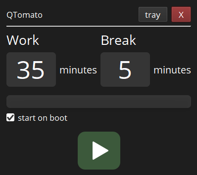

# Intrusive Tomato Timer

Hypothesis of this app is that long working sessions affect productivity in a bad way but more importantly long sitting sessions can be of great harm to health. The goal is to break sessions into chunks and suggest user to stand up and do some exercises.

> For download visit [Releases](https://github.com/modbrin/intrusive-tomato-qt/releases)

## Features
+ Break veil covers whole screen
+ Configurable work and break intervals
+ Acrylic blur background effect for Windows 10
+ Minimize to tray
+ Free and open source forever

	

#### When there are 20 seconds left until break, notification will appear (also, it's draggable if covers important content)

	

#### Break veil covers whole screen

	

## Building
Use Qt Creator for building, default version is dynamically linked. If you want to link statically, refer to Qt documentation and firstly build static version of Qt Libraries.

## Future
+ "Seamless" startup
+ Long breaks
+ Activity suggestions during breaks
+ Reminders and task tracking
+ Google Calendar / Microsoft Outlook integration
+ Learning user habits
+ Tests

## License
This software is licensed under [GPL v3](LICENSE)
